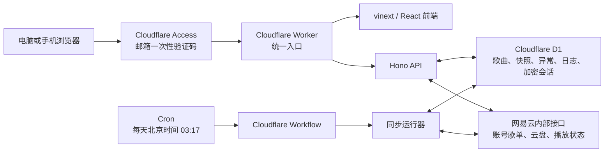
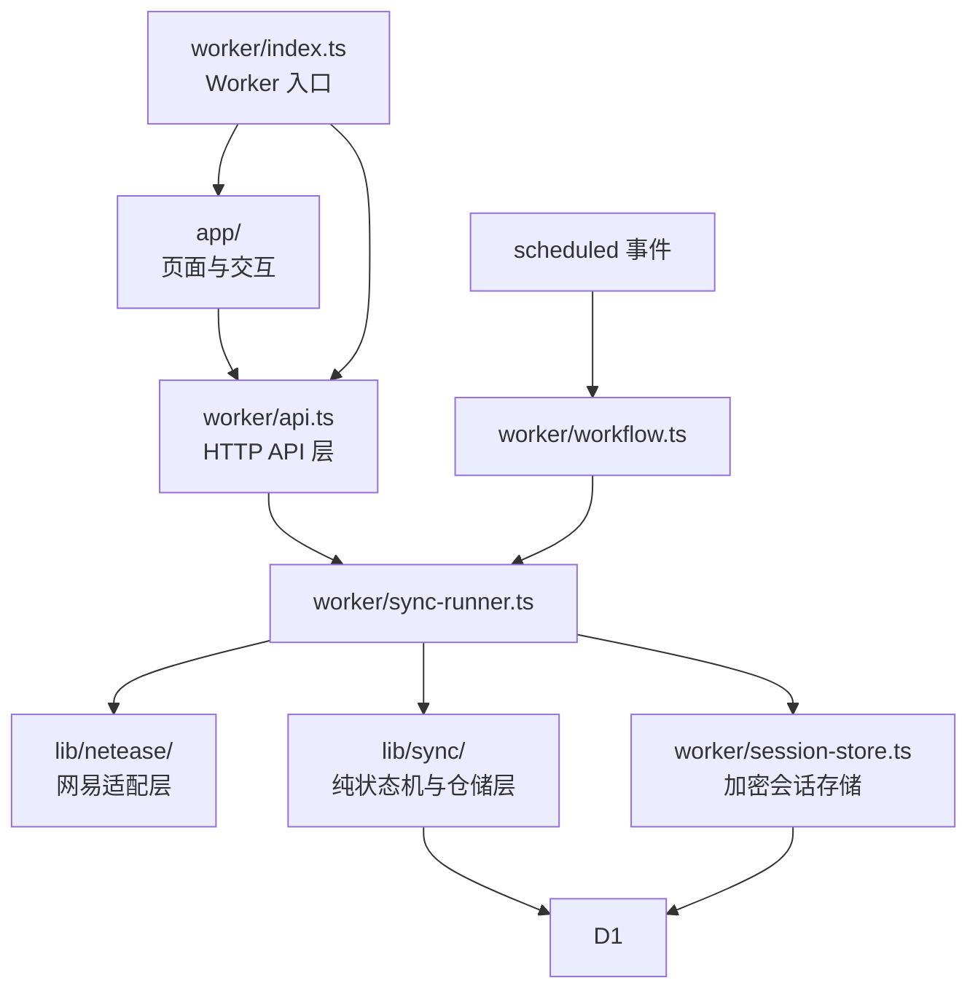
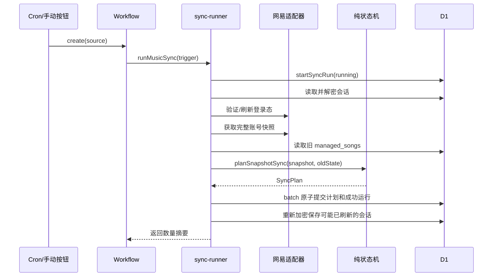

# 拾针（Needle Drop Archive）项目全解

> 文档版本：2026-08-12  
> 项目根目录：`C:\Projects\needle-drop-archive`  
> 面向读者：希望从业务目标、技术选型、代码结构、数据模型、运行流程、安全边界到部署运维，完整理解本项目的人。

---

## 1. 先用一句话理解这个项目

“拾针”是一个运行在 Cloudflare 云端的单用户网易云音乐防丢服务：它每天以你的账号视角读取当前绑定歌单，把歌曲元数据和可播状态保存到 D1 数据库，与过去快照比较，并在同一次同步的针对性复核仍然异常后，将歌曲确认为“已消失”或“已变灰”。

它不下载、不上传、也不保存音乐文件。它保存的是：

- 歌曲 ID、歌名、歌手、专辑、封面链接等元数据；
- 歌曲何时进入或离开当前绑定歌单；
- 当前账号能否播放这首歌；
- 异常的发现、确认、完成和自动恢复状态；
- 每次同步是否成功及其诊断信息；
- 加密后的网易云登录会话。

你最终面对的只有一个网站，网站里只有三个一级功能：

1. **待找回**：列出已经确认“消失”或“变灰”的歌曲；
2. **歌单歌曲**：浏览当前已归档的完整绑定歌单；
3. **同步状态**：查看定时守护、网易云登录和手动同步状态。

---

## 2. 它解决的具体问题

### 2.1 原始痛点

网易云中的收藏可能因为版权下架、资源替换或平台调整而发生变化：

- 歌曲彻底不再出现在当前绑定歌单中；
- 歌曲仍在列表里，但已经变灰、无法播放；
- 平台不会在很久以后提醒你曾经收藏过什么；
- 等你意识到时，可能已经忘记歌曲名称。

### 2.2 项目的业务定义

项目不武断地声称“网易删除了歌曲”，而是记录可验证的事实：

- **missing / 已消失**：过去在完整账号列表中存在，本次完整列表中不存在；
- **grey / 已变灰**：歌曲仍在账号列表中，但登录账号当前无法获得可播放地址；
- **normal / 正常区**：当前完整同步确认可以正常播放；
- **anomaly / 待找回**：本次完整同步内经过针对性复核后仍为 `missing` 或 `grey`；
- **不存在**：用户点击“完成”后，歌曲已经退出系统的活动管理范围。

### 2.3 为什么异常要在同一次同步内复核

网易接口可能短暂超时、返回不完整数据、触发风控，或者某一首歌的播放接口暂时异常。网络失败和不完整结果会让整次同步失败，不会被解释成歌曲异常；结构完整但内容短暂抖动的结果则通过当次针对性复核过滤。

因此项目不会等待到第二天，而是在一次 Workflow 中完成观察与复核：

```text
正常
  ↓ 完整快照首次发现异常
同步内复拉歌单成员或播放状态
  ↓ 两次结果一致
待找回 anomaly
  ↓ 任意一次完整同步确认正常可播放
正常 normal
```

两次结果不一致、复核失败或歌单在复核期间发生变化时，本次同步不写入任何歌曲状态，留到下一次完整同步重新判断。

---

## 3. 整体架构

### 3.1 一张图看懂系统



### 3.2 为什么采用这种架构

这套架构满足了原需求中的四个关键条件：

- **不需要本地常驻软件**：电脑关机后，Cloudflare 仍会每天执行任务；
- **只有一个管理网址**：页面、API、定时入口由同一个 Worker 项目承载；
- **数据长期保存**：D1 保存快照，不依赖浏览器缓存；
- **登录态不暴露给前端**：网易 Cookie 只在 Worker 内解密和使用。

### 3.3 代码分层



这里最重要的设计原则是：

- `lib/netease` 只负责“怎样可靠读取网易云”；
- `lib/sync/state-machine.ts` 只负责“给定旧状态和新快照，应该变成什么状态”；
- `lib/sync/repository.ts` 只负责“怎样把状态存进 D1”；
- `worker/sync-runner.ts` 负责把这些能力编排成一次完整同步；
- `worker/api.ts` 负责把功能暴露给网页；
- `app/` 只负责展示和交互，不负责判断歌曲是否丢失。

这种分层可以避免把核心业务规则散落在按钮事件、SQL 和网易请求代码中。

---

## 4. 项目技术栈总表

下表中的版本来自当前 `package.json`、`package-lock.json` 和本地安装结果。

| 技术 | 当前版本或配置 | 在一般项目中能做什么 | 在本项目中具体做什么 |
| --- | --- | --- | --- |
| Node.js | `24.18.0`（本机工具链） | 运行构建工具、测试和 CLI | 执行 npm、TypeScript、Vite、Wrangler 和测试；不是线上常驻服务器 |
| npm | 随 Node 工具链提供 | 管理依赖和脚本 | 使用 `package.json` 与 `package-lock.json` 固定安装结果 |
| TypeScript | `5.9.3` | 为 JavaScript 增加静态类型 | 约束前端数据、Worker bindings、网易响应、同步状态和 D1 访问接口 |
| React | `19.2.6` | 构建组件化交互界面 | 构建三个页面、弹窗、列表、筛选、同步状态和动效控制 |
| React DOM | `19.2.6` | 将 React 渲染到浏览器 DOM | 运行客户端界面 |
| Next.js API surface | `16.2.6` | App Router、Metadata、页面约定等 | 提供 `app/` 目录、Metadata、`next/headers` 等 API/类型；实际构建不走 `next build` |
| vinext | `0.0.50` | 用 Vite 实现 Next.js API，并适配 Cloudflare Workers | 运行 `vinext dev/build/start`，编译 App Router/RSC/客户端产物 |
| Vite | `8.1.5` | 开发服务器、模块编译、插件和生产构建 | 组织 vinext、React RSC 和 Cloudflare 插件，输出 `dist` |
| `@vitejs/plugin-react` | `6.0.2` | React JSX 转换和开发体验 | 支持 React/Vite 编译链 |
| `@vitejs/plugin-rsc` | `0.5.26` | React Server Components 构建环境 | 为 vinext 的 App Router 构建提供 RSC 能力 |
| `react-server-dom-webpack` | `19.2.6` | React Server Components 协议实现 | 与 React/vinext 的 RSC 版本保持一致 |
| Cloudflare Workers | `compatibility_date: 2026-07-16` | 无服务器 HTTP 与事件计算 | 托管网页、API、定时入口和网易请求逻辑 |
| `@cloudflare/vite-plugin` | `1.45.0` | 将 Vite 项目接到 Workers 本地与部署环境 | 在 Vite 构建中提供 Worker 环境、bindings 和输出 |
| `@cloudflare/workers-types` | `5.20260719.1` | 提供 Worker、D1、Workflow 等类型 | 让 TypeScript 认识 `D1Database`、`Fetcher`、`ExecutionContext` 等 |
| Hono | `4.12.30` | Web 标准风格的轻量 API 框架 | 定义 `/api/*` 路由、中间件、错误处理和 JSON 响应 |
| Cloudflare D1 | binding `DB` | 托管的 SQLite 语义关系数据库 | 保存单实例账号/歌单配置、歌曲、异常、同步运行、加密会话和临时流程 |
| SQLite / JSON SQL | D1 内置 | 关系查询、事务、索引、JSON 函数 | 使用 prepared statements、`json_each(?)` 批量 upsert 和关联查询 |
| Cloudflare Workflows | binding `MUSIC_SYNC` | 可重试、可观察的持久任务 | 承载手动和定时同步，失败时指数退避重试 |
| Cron Triggers | `17 19 * * *` UTC | 定时唤醒 Worker | 每天 UTC 19:17，即北京时间次日 03:17，启动 Workflow |
| Cloudflare Access | 邮箱 OTP + JWT | 在 Worker 前保护私有网站 | 只允许指定邮箱访问，并由 Worker 再次验证 JWT、aud 和邮箱 |
| JOSE | `6.2.3` | JWK/JWT/JWS/JWE 等标准实现 | 拉取 Access JWK，验证 `cf-access-jwt-assertion` 签名、issuer、audience |
| Web Crypto API | Worker 原生 | 加解密、随机数 | 使用 AES-256-GCM 加密网易云登录会话 |
| QRCode | `1.5.4` | 将文本编码成二维码图片 | Worker 解密短期 challenge 后生成同源 SVG；不向第三方制图服务发送登录数据 |
| Wrangler | `4.112.0` | Cloudflare 开发、迁移、Secret、部署 CLI | 本地 D1、远端迁移、Secret 配置、dry run 与正式部署 |
| ESLint | `9.39.4` | 静态代码规范检查 | 配合 `eslint-config-next 16.2.6` 检查 React/Next/TypeScript 代码 |
| Node Test Runner | Node 内置 | 无额外测试框架运行测试 | 执行状态机、SQL、Secret、配置和渲染源码测试 |
| `node:sqlite` | Node 24 内置 | 本地 SQLite | 在内存数据库中验证 D1 兼容 SQL 与事务行为 |
| CSS | 原生 CSS，约 2186 行 | 布局、响应式、动画、可访问性 | 实现黑胶霓虹舞台、移动端布局和三档动态效果 |
| Web APIs | Fetch、Headers、AbortSignal、IntersectionObserver、localStorage 等 | 跨运行时网络和浏览器能力 | Worker 请求网易，前端分页加载、超时、动效偏好和可见性降级 |

### 4.1 运行时依赖与开发依赖的区别

`dependencies` 会参与应用运行或被构建进部署产物：

- `hono`
- `jose`
- `next`
- `qrcode`
- `react`
- `react-dom`

`devDependencies` 主要用于本地编译、类型检查、测试和部署工具：

- Cloudflare Vite 插件和 Workers 类型；
- Vite、vinext、RSC 插件；
- TypeScript、ESLint 和类型声明；
- Wrangler。

需要注意：这是“角色分类”，不是简单地说 devDependency 永远不会进入产物。构建器会根据引用关系打包所需代码；而 Wrangler 本身作为 CLI 不会被上传成线上运行逻辑。

### 4.2 为什么项目同时有 Next.js、vinext 和 Vite

这是本项目最容易误解的技术点。

- **Next.js** 定义了熟悉的应用结构和 API，例如 `app/layout.tsx`、`app/page.tsx`、Metadata、`next/headers`；
- **vinext** 重新实现了项目实际使用的 Next.js API surface；
- **Vite** 是真正负责开发服务器和生产编译的构建器；
- **Cloudflare Vite Plugin** 把构建结果与 Worker 运行时及 bindings 接起来。

因此本项目的脚本是：

```json
{
  "dev": "vinext dev",
  "build": "vinext build",
  "start": "vinext start"
}
```

而不是 `next dev`、`next build`。Cloudflare 官方的 vinext 项目也明确说明它仍在积极开发中，因此升级 `vinext`、React、Next、Vite 或 RSC 相关包时，必须把它们视为一组兼容矩阵一起验证，不能只随意升级其中一个。

### 4.3 “稳定版本”与“能正常启动”不是同一个判断

当前 Next.js、React、Hono、Vite、Cloudflare Vite Plugin 和 Wrangler 使用的是各自正常发布的版本；但 `vinext 0.0.50` 与 `@vitejs/plugin-rsc 0.5.26` 都仍处于 `1.0` 以前，版本号本身就表示 API 和兼容关系尚未完全稳定。项目能构建、部署和运行，只能证明已经覆盖的功能路径在当前组合下可用，不能证明依赖没有后来公开的安全公告。

依赖审计结果也不能机械地等同于“项目一定可被攻击”。正确做法是逐条判断：受影响代码是否会进入 Worker、项目是否调用相关能力、Cloudflare Access 是否改变攻击前提、是否存在兼容的修复版本。尤其不能为了让审计数字归零，未经真实登录、RSC、Workflow 和部署回归就跨到新的 beta 主线。依赖变化的发布规则见 19.4；当前文档修订没有修改任何依赖。

---

## 5. 目录结构与每个文件的职责

```text
needle-drop-archive/
├─ app/
│  ├─ components/MusicVault.tsx   # 整个前端产品界面与交互
│  ├─ chatgpt-auth.ts             # Sites/ChatGPT 登录辅助模板；当前 Worker 主链未使用
│  ├─ globals.css                 # 全局样式、响应式和全部动效
│  ├─ layout.tsx                  # HTML 根布局、SEO、OG、viewport
│  ├─ page.tsx                    # 首页，只挂载 MusicVault
│  └─ ui-types.ts                 # 前端领域类型
├─ build/
│  └─ sites-vite-plugin.ts        # 构建结束时整理可选元数据与迁移副本
├─ drizzle/                       # 按编号执行的 D1 数据库迁移
├─ lib/
│  ├─ netease/                    # 网易云只读适配层
│  │  ├─ client.ts                # 网络请求、分页、批处理、快照与数据判定
│  │  ├─ session.ts               # 不透明 Cookie 会话及安全序列化
│  │  ├─ errors.ts                # 不泄密的结构化错误
│  │  ├─ types.ts                 # 网易领域类型
│  │  ├─ selftest.ts              # 假服务端确定性自测
│  │  ├─ public-smoke.ts          # 公开接口烟雾测试
│  │  ├─ index.ts                 # 导出入口
│  │  └─ README.md                # 适配器安全边界
│  └─ sync/                       # 同步领域层
│     ├─ state-machine.ts         # 纯状态转换：本项目的业务核心
│     ├─ repository.ts            # D1 SQL、事务、列表与统计
│     ├─ service.ts               # 校验 → 读取旧状态 → 规划 → 提交
│     ├─ storage.ts               # 通用会话与设置仓储辅助
│     └─ index.ts                 # 导出入口
├─ public/
│  ├─ _headers                    # 静态资源安全头和缓存策略
│  ├─ favicon.svg                 # 站点图标
│  └─ og.png                      # 社交分享图
├─ scripts/
│  ├─ bootstrap-cloudflare.ps1    # 查找/创建并绑定 D1 的一次性脚本
│  ├─ cloudflare-deploy.mjs       # 选择私有配置并安全调用 Wrangler
│  ├─ deployment-policy.mjs       # Secret 查询与失败关闭策略
│  ├─ setup-cloudflare.ps1        # Windows 一站式幂等安装入口
│  └─ scrub-build-secrets.mjs     # 清理/拒绝构建产物中的本地 Secret
├─ tests/
│  ├─ deployment-config.test.mjs  # Cron 和 Workflow 配置测试
│  ├─ managed-songs-migration.test.mjs
│  ├─ playlist-binding-security.test.mjs
│  ├─ rendered-html.test.mjs      # 三页面、真实 API、动效约束测试
│  ├─ secrets.test.ts             # AES-GCM 测试
│  ├─ sync-repository-sql.test.mjs# SQLite/D1 SQL 与并发锁测试
│  └─ sync-state-machine.test.mjs # 异常确认、锁定与即时恢复测试
├─ worker/
│  ├─ index.ts                    # Worker fetch/scheduled 总入口
│  ├─ api.ts                      # Hono API
│  ├─ auth-flows.ts               # 扫码流程、过期清理和待确认会话
│  ├─ binding-runner.ts           # 新歌单完整基线与原子切换
│  ├─ instance-config.ts          # 单实例配置及旧实例兼容迁移
│  ├─ workflow.ts                 # Workflow Entrypoint
│  ├─ sync-runner.ts              # 一次同步的总编排器
│  ├─ access.ts                   # Cloudflare Access JWT 与写请求来源校验
│  ├─ session-store.ts            # 加密网易会话的 D1 存取
│  ├─ secrets.ts                  # AES-256-GCM
│  └─ env.ts                      # 所有 Worker bindings 和环境变量类型
├─ .dev.vars.local.example        # 仅供本地开发的变量模板
├─ .gitignore                     # 忽略依赖、产物、Secret 和工具状态
├─ package.json                   # 依赖与 npm 脚本
├─ package-lock.json              # 可复现的精确依赖树
├─ SECURITY.md                    # 数据边界、私密报告和密钥恢复
├─ vite.config.ts                 # vinext + 构建辅助插件 + Cloudflare 编排
├─ next.config.ts                 # Next API 配置入口，目前为空配置
├─ tsconfig.json                  # TypeScript 严格模式与 Workers/Node 类型
├─ eslint.config.mjs              # ESLint 9 flat config
├─ wrangler.jsonc                 # 正式 Worker/D1/Workflow/Cron/变量配置
└─ README.md                      # 快速部署与运维手册
```

### 5.1 哪些目录是生成物

以下内容不应被当成手写源码：

- `node_modules/`：npm 安装的依赖；
- `dist/`：生产构建输出；
- `.vinext/`：vinext 中间产物；
- `.wrangler/`：Wrangler/Miniflare 本地状态；
- `tsconfig.tsbuildinfo`：TypeScript 增量编译缓存；
- `.run/`：本地运行辅助状态；
- `outputs/`、`work/`：工作产物目录，目前没有业务源码。

这些目录已由 `.gitignore` 处理。真正应长期维护的是 `app/`、`worker/`、`lib/`、`drizzle/`、`tests/`、配置文件和文档。

---

## 6. Worker 是怎样接住所有请求的

入口位于 `worker/index.ts`。

### 6.1 HTTP 请求分流

```text
收到请求
  ├─ 路径是 /api 或 /api/*
  │    └─ 交给 Hono：worker/api.ts
  ├─ 路径是 /_vinext/image 且配置了 IMAGES binding
  │    └─ 交给 vinext 图片优化逻辑
  └─ 其他路径
       └─ 交给 vinext App Router handler
```

当前 `wrangler.jsonc` 没有配置 `IMAGES` binding，因此远程歌曲封面在前端使用原生 `` 加载；这也避免了云盘封面域名不固定时维护图片域名 allowlist。

### 6.2 定时事件分流

同一个默认导出对象还实现了 `scheduled()`：

1. Cron 到点唤醒 Worker；
2. Worker 检查 `MUSIC_SYNC` binding；
3. 创建一个 Workflow 实例；
4. HTTP 请求不参与实际同步，也不需要保持连接。

这使“打开网页”和“每天自动运行”完全解耦。

---

## 7. 前端是怎样实现的

### 7.1 页面骨架

`app/page.tsx` 非常薄，只返回 `<MusicVault />`。绝大多数界面逻辑集中在 `app/components/MusicVault.tsx`，这是一个带 `"use client"` 的客户端组件。

它内部拆成若干局部组件：

- `RecoveryView`：待找回列表；
- `LikesView`：歌单歌曲；
- `SyncView`：同步状态；
- `QrModal`：网易云扫码授权；
- `PlaylistModal`：选择自建、私密或收藏的可访问歌单；
- `VinylHero`、`AmbientStage`：黑胶和环境特效；
- `SearchBox`、`FilterPills`、`SongCover`：通用交互组件。

### 7.2 三个页面的数据来源

| 页面 | API | 主要数据 |
| --- | --- | --- |
| 待找回 | `GET /api/recovery` | 只返回 `status = open` 的确认异常 |
| 歌单歌曲 | `GET /api/likes` | 当前 `managed_songs` 中的歌曲 |
| 同步状态 | `GET /api/sync/status` | 最近运行、会话、数量、下次时间 |

前端不会自行比较歌曲，也不会把某首歌判成灰歌；它只展示后端已经计算好的真实状态。

### 7.3 为什么前端有一层 normalize

`normalizeSong()`、`normalizeRecovery()`、`normalizeStatus()` 会将后端 JSON 转成稳定的前端类型。这一层允许字段名称存在有限兼容别名，并对未知值使用安全降级。

好处是 UI 不会因某个可选字段缺失立刻崩溃；但业务真相仍来自后端，normalize 不能创造歌曲或异常。

### 7.4 分页和搜索

- 每页最多读取 100 首；
- API 使用数字 offset 作为 cursor；
- “歌单歌曲”使用 `IntersectionObserver`，用户接近底部时自动载入下一页；
- 待找回支持按钮继续载入；
- 搜索输入会延迟约 280ms，避免每次按键立即请求；
- 搜索由 D1 对歌名、歌手 JSON 文本和专辑执行 `LIKE` 查询；
- 前端还会对当前已加载内容做一次过滤，保证界面及时响应。

### 7.5 同步后的自动刷新

前端会在同步状态为 `queued` 或 `running` 时，每约 2.6 秒刷新一次状态。当 `lastSuccessAt` 变化后，它会重新读取：

- “歌单歌曲”；
- “待找回”；
- 同步状态。

这样首次同步或手动同步完成后，不需要用户刷新整页。

### 7.6 动效与性能降级

界面提供三档动效：

- `immersive`：沉浸；
- `balanced`：均衡；
- `static`：静态。

选择只保存在浏览器 `localStorage`，它不是业务数据。首次打开时：

- 系统设置了 `prefers-reduced-motion: reduce`，自动使用静态；
- 设备逻辑核心数较少，自动使用均衡；
- 页面进入后台，通过 `visibilitychange` 暂停不必要动画；
- CSS 还提供 `prefers-reduced-motion` 的最终保护。

### 7.7 元数据与静态安全头

`app/layout.tsx` 负责：

- 中文页面语言；
- 标题、描述、Open Graph 和 Twitter Card；
- 根据当前请求 host 生成绝对的分享图片地址；
- 深色主题色和 favicon。

`public/_headers` 负责静态资源层面的：

- MIME 嗅探保护；
- 禁止被 iframe 嵌入；
- 不发送 referrer；
- 禁用摄像头、麦克风、定位、支付、USB 等无关能力；
- 为带指纹的静态资源配置长期缓存。

---

## 8. API 层是怎样实现的

`worker/api.ts` 使用 Hono。Hono 在这里相当于“适合 Worker 的轻量 Express”：提供路由、上下文、middleware 和错误处理，但基于标准 `Request`/`Response`。

### 8.1 所有 API 的共同中间件

每个 `/api/*` 请求都会先执行：

1. 验证 Cloudflare Access 身份；
2. 对写请求校验 `Origin`；
3. 对写请求要求 `X-Requested-With: ncm-archive`；
4. 给响应增加 `Cache-Control: no-store`；
5. 给响应增加 `X-Content-Type-Options: nosniff`。

### 8.2 API 清单

| 方法与路径 | 用途 | 是否修改状态 |
| --- | --- | --- |
| `GET /api/recovery` | 分页、筛选、搜索待找回记录 | 否 |
| `POST /api/recovery/:songId/complete` | 物理删除当前仍为异常的活动歌曲 | 是 |
| `GET /api/likes` | 分页、搜索全部活动歌曲（正常、变灰、消失） | 否 |
| `GET /api/sync/status` | 获取账号、歌单、会话、同步和重绑综合状态 | 否 |
| `POST /api/sync` | 创建手动 Workflow | 是 |
| `POST /api/netease/auth-flows` | 创建首次连接或重新授权流程 | 是 |
| `POST /api/netease/auth-flows/:id/poll` | 轮询扫码状态；授权成功后加密保存正式或待确认会话 | 授权成功时是 |
| `GET /api/netease/auth-flows/:id/qr` | 返回同源、禁止缓存的二维码 SVG | 否 |
| `POST /api/netease/auth-flows/:id/cancel` | 取消尚未进入绑定任务的登录流程 | 是 |
| `POST /api/netease/playlists` | 使用正式或待确认会话分页读取可访问歌单 | 否 |
| `POST /api/playlist-binding` | 选择歌单并启动完整基线 Workflow | 是 |

### 8.3 错误返回

错误统一返回 JSON，并禁用缓存。主要层次包括：

- 参数错误：400；
- Access 缺失或会话过期：401；
- 无权限或来源校验失败：403；
- 资源不存在：404；
- 二维码创建过快：429；
- 网易上游或风控问题：502/503；
- 未预期错误：500。

网易错误日志只记录错误种类、endpoint、HTTP 状态、API code 和是否可重试；不会记录 Cookie、请求头或响应正文。

---

## 9. 两套登录分别是什么

项目存在两层完全不同的登录，理解它们非常重要。

### 9.1 第一层：进入管理网站

这是 Cloudflare Access：

- 用户打开网站；
- Access 要求输入允许的邮箱；
- 邮箱收到一次性 PIN；
- 验证成功后，Access 把带身份信息的 JWT 传给 Worker。

`worker/access.ts` 不只相信“请求已经经过 Access”，还会主动：

1. 从团队域名的 `/cdn-cgi/access/certs` 获取 JWK；
2. 用 `jose.jwtVerify()` 验证签名；
3. 验证 issuer；
4. 验证应用 audience；
5. 读取 email；
6. 要求它与 `ALLOWED_EMAIL` 精确匹配。

JWK resolver 按团队域名缓存在当前 Worker isolate 的内存中。这个缓存只是性能优化，不是永久状态。

### 9.2 第二层：后台读取网易云账号

这是网易云扫码会话：

1. 网站向 Worker 创建首次连接或重新授权流程；
2. Worker 将 challenge 加密保存到 D1，并使用已有的 `qrcode` 生成同源 SVG；浏览器只拿随机流程 ID 和图片路径；
3. 用户用网易云 App 扫码并确认；
4. 浏览器轮询 Worker；
5. Worker 向网易查询扫码状态；
6. 网易授权成功后，Cookie 只存在于 Worker 内；
7. 首次连接时，加密保存会话并进入歌单选择；
8. 重新授权为同一 UID 时原子替换正式会话并保留历史；不同 UID 时只保存短期待确认会话，切换成功前旧账号和旧历史不变；
9. 用户选择歌单后，Workflow 完整读取成员、歌曲详情和账号可播状态；只有完整基线验证成功才原子启用新绑定。

网站 Access 登录成功，不代表网易云已经授权；网易云授权成功，也不代表任何人都能打开网站。这两层分别保护“谁能使用管理台”和“后台以哪个网易账号读取数据”。

### 9.3 为什么网易会话不是普通对象

`lib/netease/session.ts` 将 Cookie 放在 `WeakMap<NeteaseSession, SessionData>` 中，而不是放在实例公开属性中。

结果是：

- `JSON.stringify(session)` 只会得到脱敏信息；
- 日志误打印对象时不会列出 Cookie；
- 只有内部函数 `sessionCookieHeader()` 能生成请求头；
- 只有 `serializeNeteaseSession()` 能越过明文边界；
- 明文序列化结果应立即交给 AES-GCM 加密，不得返回浏览器。

### 9.4 AES-256-GCM 如何工作

`worker/secrets.ts`：

- 要求 `SESSION_ENCRYPTION_KEY` 是 32 字节随机密钥的 Base64；
- 每次保存生成新的 12 字节随机 nonce；
- 使用 Web Crypto `crypto.subtle`；
- 算法为 AES-GCM；
- D1 只保存 ciphertext、nonce 和 key version；
- 同一明文两次加密会得到不同密文。

GCM 同时提供机密性和完整性：密文被篡改时，解密会失败。

当前没有在线密钥轮换/重加密流程。只丢失本地密钥副本不会影响仍持有 Secret 的线上 Worker，也不应因此覆盖线上 Secret。若线上 Secret 已删除、覆盖或疑似泄露，应先备份 D1，只清理无法解密的待绑定、认证流程和会话记录，再设置新 Secret 并执行“重新授权”；`instance_config`、`songs`、`managed_songs` 和 `sync_runs` 不应删除。完整恢复步骤见 `SECURITY.md`。

---

## 10. 网易云适配层是怎样工作的

### 10.1 为什么叫“适配层”

网易云没有为本用途提供稳定、正式、带长期兼容承诺的开放 API。`lib/netease` 把所有不稳定性包在一个边界内，让其他代码只依赖稳定的项目内部类型。

如果未来网易改接口，原则上优先修改 `lib/netease/client.ts`，而不是重写状态机或前端。

### 10.2 请求限制

客户端有两个硬限制：

- origin 只能是 `https://music.163.com` 或 `https://interface.music.163.com`；
- path 必须匹配 `/api/**` 的安全字符规则。

生产默认使用 `https://interface.music.163.com`，因为历史验证中它从 Cloudflare Worker 到网易的网络兼容性更好。展示给用户的歌曲链接仍使用 `music.163.com`。

请求统一使用：

- `POST`；
- `application/x-www-form-urlencoded`；
- 固定 Referer 和 User-Agent；
- `AbortController` 超时；
- 默认一次重试；
- 重试前短暂指数退避；
- `cache: no-store`。

### 10.3 当前使用的网易接口

| 内部路径 | 作用 |
| --- | --- |
| `/api/login/qrcode/unikey` | 创建扫码 key |
| `/api/login/qrcode/client/login` | 查询扫码状态并取得会话 |
| `/api/nuser/account/get` | 验证登录态与账号资料 |
| `/api/login/token/refresh` | 尝试刷新会话 |
| `/api/v6/playlist/detail` | 读取歌单详情、trackIds、嵌入歌曲 |
| `/api/v1/cloud/get` | 分页读取个人云盘 |
| `/api/v1/cloud/get/byids` | 按 ID 读取云盘详情 |
| `/api/v3/song/detail` | 批量读取歌曲元数据 |
| `/api/song/enhance/player/url` | 以当前账号判断是否真正可播 |

这些路径属于内部接口，可能随网易变化。项目的正确反应是“明确失败并保留旧快照”，而不是猜测字段或把空列表当成全丢失。

### 10.4 为什么不能用 fee/copyright 判断灰歌

公开元数据中的 `fee`、`copyright`、`noCopyrightRcmd` 等字段不能回答“这个账号现在能不能播放”：

- 会员、购买、地区和账号权限会影响结果；
- 个人云盘歌曲对本人可播，但公开曲库可能标记无版权；
- 匿名播放接口会把大量本账号其实可播的歌曲判成不可播。

因此项目只以登录账号请求播放地址的结果作为账号级可播性依据。

### 10.5 完整账号快照怎样组装

`getAccountSnapshot()` 按顺序执行，避免请求爆发触发风控：

1. 验证登录态；
2. 验证 UID；
3. 读取歌单详情；
4. 以所选歌单完整 `trackIds` 作为成员基线；
5. 批量补充歌曲详情；
6. 只对标准详情缺失的条目读取云盘回退；
7. 批量检查每首歌是否可播；
8. 用标准详情、云盘详情、歌单嵌入详情或占位信息按优先级补齐元数据；
9. 返回完整、去重、每首都有 boolean 可播状态的快照。

当前批次参数：

- 歌曲详情：最多 400 首一批；
- 播放状态：最多 200 首一批；
- 云盘分页：每页 200；
- 云盘硬安全上限：10000 首。

### 10.6 哪个列表是成员主基线

当前绑定歌单详情中的完整 `trackIds` 是唯一成员主基线，因此逻辑适用于自建、私密和收藏的他人歌单，不再固定读取 `/api/song/like/get`。

项目严格验证完整性：

- 歌单 `trackIds.length` 与 `trackCount` 不一致：失败；
- 歌曲详情缺失且标准、云盘、歌单嵌入详情都无法回退：失败；
- 播放响应遗漏任何请求 ID：失败；
- 新基线为空：暂不允许绑定。

### 10.7 云盘详情回退

歌单成员 ID 始终保持为歌单返回的原始 ID。标准歌曲详情缺失时，项目才查询云盘详情，并可使用其 `simpleSong` 元数据补齐展示；不会把未被所选歌单列出的账号歌曲混入基线。

这样既避免一首歌重复入库，也避免把两个真实独立收藏错误合并。

### 10.8 账号、歌单和歌曲怎样分层判定

扫码授权阶段只负责账号状态：登录资料必须有效。首次登录或不同 UID 重新授权后，用户从当前账号全部可访问歌单中选择一个目标；同一 UID 重新授权只原子替换加密会话。匿名、会话过期、风控和 UID 不匹配使用独立错误码；其中风控只停止本次操作，不删除已保存会话。

完整同步阶段负责歌单状态：歌单 ID 与所有者必须正确；所选歌单完整成员、云盘回退和歌曲批次必须结构完整；云盘别名归一后不得存在无法解释的歌单 ID 缺口。数量口径可以不同，但响应遗漏或分页不完整会令整次同步失败。标准歌曲详情缺项只有在云盘或歌单内嵌资料能解释时才可以使用回退资料，否则视为不完整快照。

歌曲状态完全由本轮账号数据决定：

- 播放项 `code = 200` 且 `url` 非空：可播放；
- 返回了对应歌曲的合法播放项但没有有效地址：不可播放观察；
- 请求失败、顶层 API 失败或请求 ID 被遗漏：快照失败，不是灰歌；
- 所选歌单的完整成员快照中没有旧 ID：缺失观察。

播放码和 `no_url`、`not_found`、`payment_required`、`account_restricted` 等原因保留在适配器内部诊断中；业务页面仍只使用正常、变灰和消失。这个设计仍是“一实例一个 Access 用户、一个网易账号和一个歌单”的单用户产品，但 UID 和歌单由用户登录选择并保存在 D1，不再写死；若要多用户化，必须重构配置、表结构、Access 授权和会话主键。

---

## 11. 数据库模型

### 11.1 实体关系

```mermaid
erDiagram
    songs ||--o| managed_songs : "一首活动歌曲最多一个状态"
    netease_sessions ||--o{ netease_auth_flows : "流程可引用会话"
    netease_sessions ||--o{ pending_playlist_bindings : "待绑定使用会话"
    netease_auth_flows o|--o{ pending_playlist_bindings : "不同账号切换来源"

    songs {
      text id PK
      text title
      text artists
      text album
      text cover_url
      text netease_url
    }

    managed_songs {
      text song_id PK_FK
      text bucket
      text anomaly_type
      text first_seen_at
      text last_seen_at
      text last_playable_at
      text confirmed_at
    }

    sync_runs {
      text id PK
      text trigger
      text status
      text phase
      integer binding_version
      integer current_song_count
      text error_code
    }

    instance_config {
      text id PK
      text account_uid
      text playlist_id
      integer binding_version
      text status
      text bound_at
    }

    netease_sessions {
      text id PK
      text ciphertext
      text nonce
      integer key_version
      text uid
      text status
    }

    netease_auth_flows {
      text id PK
      text mode
      text challenge_ciphertext
      text challenge_nonce
      text status
      text session_id FK
      text expires_at
    }

    pending_playlist_bindings {
      text id PK
      text auth_flow_id FK
      text session_id FK
      text account_uid
      text playlist_id
      integer base_binding_version
      text status
      text workflow_id
    }

    settings {
      text key PK
      text value
    }
```

### 11.2 `songs`：歌曲资料

一首网易歌曲 ID 对应一行，保存当前已知元数据。只要歌曲仍在 `managed_songs` 中，它的资料就会保留；点击“完成”后，如果没有任何活动引用，资料也会一并物理删除。

`artists` 以 JSON 数组字符串保存，例如：

```json
["牛奶咖啡"]
```

### 11.3 `managed_songs`：唯一活动歌曲状态

`song_id` 同时是主键和指向 `songs.id` 的外键，因此同一网易歌曲 ID 永远最多一行。`bucket` 只有两个值：

- `normal`：当前确认正常播放的歌曲；
- `anomaly`：在同一次完整同步中复核确认的 `grey` 或 `missing`。

正常行必须没有 `anomaly_type` 和 `confirmed_at`，异常行必须同时具备这两个字段。这些约束直接写在 D1 schema 中，不只依赖 TypeScript 自觉维护。

所谓“正常表”和“异常表”只是对这一张表的两种查询，不再是两份可能重复的数据。`playlist_memberships` 与 `recovery_incidents` 已在迁移完成并验证后删除。

### 11.4 `sync_runs`：运行诊断

保存最近同步的：

- 触发来源：scheduled/manual；
- 状态和阶段；
- 开始、观察和完成时间；
- 当前歌曲数、新增数、确认异常数和自动恢复数；
- 错误 code 和不含敏感信息的错误 message。

成功提交或失败记录后都会清理，只保留最近 30 条。

### 11.5 `instance_config`：单实例正式绑定

固定主键为 `primary`，保存正式网易账号、当前歌单、所有者元数据、状态、绑定时间和 `binding_version`。昵称、头像、UID、歌单 ID 和名称来自登录与选择流程，不再写死在业务代码或公开 Wrangler 配置中。

`binding_version` 是并发隔离边界：普通同步启动时捕获当前版本，提交歌曲和刷新会话前必须再次匹配。重绑成功后版本递增，仍在运行的旧 Workflow 不能把旧歌单数据重新写回。

### 11.6 `netease_sessions`：加密会话

正式会话使用主键 `primary`；不同账号重新授权时可短期存在 `pending:<flow-id>` 会话。表中保存密文、nonce、算法、密钥版本、UID、状态和验证/刷新时间，不保存明文 Cookie。解密密钥只存在于 Worker Secret。

### 11.7 `netease_auth_flows`：短期扫码流程

保存首次连接或重新授权模式、加密 challenge、状态、待确认账号元数据、关联会话和过期时间。challenge 不作为 JSON 字段或请求参数返回；二维码路由只包含随机 flow ID，并返回禁止缓存的同源 SVG。完成、取消或过期流程会清理对应临时数据。

### 11.8 `pending_playlist_bindings`：安全重绑进度

保存目标账号和歌单元数据、基础 `binding_version`、Workflow ID、状态以及不含上游正文的错误信息。完整基线在 D1 事务外准备；只有全部验证成功，才通过一次 D1 `batch()` 切换正式配置、会话和歌曲状态。失败时旧绑定和旧历史保持不变。

### 11.9 `settings`：小型 JSON 配置仓库

当前会保存类似：

- `manual_sync_queue`：手动任务排队标记；
- `qr_rate:<email>`：二维码创建限速时间。

`netease_profile` 仅是旧实例迁移来源，迁入 `instance_config` 后会删除。限速键中的邮箱位于该用户自己的 D1，不进入公共 Git；在当前一实例一用户模型下它也可以改成固定键，但这属于数据最小化选择，不是凭据泄露漏洞。

### 11.10 为什么使用 Prepared Statements 和 D1 batch

所有变量都通过 `.bind(...)` 传入，避免把用户输入直接拼接到 SQL。

同步提交使用 D1 `batch([...])`：

1. 批量 upsert 歌曲；
2. 批量 upsert `managed_songs`；
3. 将 sync run 标记为成功；
4. 清理旧运行记录。

D1 batch 是事务：其中任何一条失败，整个批次回滚。这样不会出现“歌曲写了一半，但运行却显示成功”的状态。

批量 upsert 不会按当前歌曲总数生成同等数量的独立 SQL，而是把对象数组序列化为 JSON，再用 SQLite JSON 扩展的 `json_each(?)` 展开。这减少了数据库往返和 prepared statement 数量。

---

## 12. 同步状态机：项目最核心的业务代码

核心文件是 `lib/sync/state-machine.ts`。它是纯函数：输入“完整新快照 + 数据库旧状态”，输出一个 `SyncPlan`，不直接访问网络或数据库。

### 12.1 为什么纯状态机很重要

它带来四个好处：

- 不需要启动 Worker 就能测试业务规则；
- 同样输入必然得到同样输出；
- 规划失败时不会写一半数据库；
- 网易接口、D1、前端改动不会轻易污染判断逻辑。

### 12.2 快照进入状态机前的硬校验

`assertCompleteSnapshot()` 要求：

- `observedAt` 是有效时间；
- `complete === true`；
- `declaredTrackCount` 是大于 0 的安全整数；
- `songs.length` 与声明数量完全一致；
- 每首歌 ID 和标题非空；
- 没有重复 ID；
- artists 是字符串数组；
- 每首歌必须有明确 boolean `accountPlayable`。

任何一项失败，快照不会进入数据库。

### 12.3 第一次同步

如果数据库没有任何 `managed_songs`：

- 为当前全部歌曲各建立一行活动记录；
- 保存歌曲元数据和可播状态；
- 对不可播放歌曲再次查询账号级播放状态，两次都不可播放时直接建立为 `anomaly + grey`；
- 不把任何歌曲算作“新增”；
- 不根据服务上线前的历史做丢失推断。

这叫建立基线。

### 12.4 新增歌曲

本次快照出现、过去当前列表中没有的 ID：

- 新建 `songs` 资料和 `managed_songs normal`；
- 非首次基线时 `newCount + 1`；
- 自动进入“歌单歌曲”。

### 12.5 已消失

过去存在于 `managed_songs normal`，本次快照没有该 ID：

- 再次读取完整歌单成员；
- 两次成员集合必须完全一致且该 ID 仍不存在，原行才立即转为 `anomaly + missing`；
- 第二次结果变化、不完整或请求失败时，整次同步不写入状态。

### 12.6 已变灰

本次仍有该 ID，但 `accountPlayable === false`：

- 只对这些疑似灰歌再次查询账号级播放状态；
- 第二次仍不可播放时，原行立即转为 `anomaly + grey`；
- 第二次恢复可播放时按正常状态提交；复核失败时整次同步不写入状态。

### 12.7 为什么灰歌被手动取消收藏后不再生成 missing

用户找回灰歌时的合理步骤是：

1. 先取消收藏旧灰歌；
2. 上传云盘文件；
3. 收藏云盘版本。

在第 1 和第 3 步之间，旧 ID 会从歌单消失。如果系统此时再生成一条 missing，就会为同一问题显示两条待找回。

因此，只要这首歌已经是 `anomaly + grey`，移出歌单时仍保留原 grey，不改成 missing。

### 12.8 手动“完成”

点击“完成”不会保留一条隐藏历史事件，而是执行条件物理删除：

```text
只在 bucket = anomaly 时删除 songs 中的歌曲
managed_songs 通过外键级联一并删除
```

如果过期页面发出完成请求，但同步已经将歌曲恢复为 `normal`，条件删除不会命中，歌曲不会被误删，接口会要求页面刷新。如果用户完成后网易快照仍包含同一个异常 ID，后续同步会把它作为新活动歌曲重新纳入，因此正确工作流仍是先在网易云处理旧歌，再点击完成。

### 12.9 自动恢复

已确认异常只要在任意一次完整同步中同时满足“仍在歌单且可以播放”，就在本次事务中直接从 `anomaly` 转回 `normal`，避免正常歌曲继续停留在异常列表并被用户误点完成。

### 12.10 短暂异常自行消失

如果第一次播放查询异常、第二次复核已经恢复，歌曲始终留在 `normal`，不进入待找回，也不会留下事件。如果歌曲已经进入 `anomaly`，后续任意一次完整同步确认可播放，仍会立即恢复为 `normal`。

---

## 13. 一次完整同步的逐步实现

### 13.1 两个入口

同步可以来自：

- Cron：`worker/index.ts` 的 `scheduled()`；
- 用户按钮：`POST /api/sync`。

两者最终都创建 `MUSIC_SYNC` Workflow，参数只标识 `scheduled` 或 `manual`。

本地开发若没有 Workflow binding，API 会使用 `executionCtx.waitUntil()` 启动同一个同步函数作为后备路径。

### 13.2 Workflow

`worker/workflow.ts` 定义 `MusicSyncWorkflow extends WorkflowEntrypoint`。

它使用一个 durable step：

```text
validate, read and atomically compare the complete playlist
```

配置为：

- 最多重试 2 次；
- 首次延迟 30 秒；
- 指数退避；
- 单步 timeout 10 分钟；
- 输出标为 sensitive。

这里把整个“读取 + 判断 + 事务提交”放在同一步，是因为它已经通过完整快照校验和 D1 事务保证重跑安全。未来若数据量显著增加，也可以进一步拆成持久步骤，但拆分时必须重新设计敏感输出和幂等性。

### 13.3 `runMusicSync()` 的完整流程



逐项解释：

1. 生成本次 `runId` 和开始时间；
2. 检查最近 15 分钟是否已有 running 同步，防止并发；
3. 解密网易会话；
4. 如果没有会话或已标记重新授权，立即失败；
5. 查询登录状态；
6. 无效时尝试 refresh；
7. 再次验证 UID；
8. 将运行阶段改为 `fetch_snapshot`；
9. 获取并严格校验完整账号快照；
10. 将运行阶段改为 `compare_and_commit`；
11. 读取旧同步状态；
12. 用纯状态机生成 SyncPlan；
13. 在一个 D1 batch 中提交歌曲、成员、异常和成功运行；
14. 重新加密保存会话，包括网易返回的更新 Cookie；
15. 返回本轮汇总，供 Workflow 记录执行结果。

### 13.4 同步失败时发生什么

任何异常都会进入统一 catch：

- 将网易错误映射为安全错误码；
- 鉴权或 UID 错误会把会话标为 `reauth_required`；
- 将本次 `sync_runs` 记录为 failed 或 reauth_required；
- 重新抛出错误，让 Workflow 知道这一步失败并按策略重试。

关键点：歌曲和 `managed_songs` 的有效状态不会被这次失败修改。接口返回空、分页缺失或风控都不会被误判为“所有歌都消失”。

### 13.5 并发和重复点击保护

有两层保护：

- API 的 `manual_sync_queue` 在 15 分钟窗口内避免重复创建手动任务；
- `startSyncRun()` 检查最近 15 分钟的 running 记录，拒绝并发执行。

旧的 running 记录超过 15 分钟后视为陈旧，不会永远锁死系统。

---

## 14. 状态查看策略（无外部通知）

项目有意不发送邮件、短信或其他推送。同步结果全部持久化到 D1，并通过网站查看：

- “待找回”显示已经在同步内复核确认的消失或变灰歌曲；
- “同步状态”显示上次同步、下次计划、网易登录态和错误；
- 网易会话失效后状态会变为 `reauth_required`，需要用户打开网站重新扫码；
- Cloudflare Dashboard 的 Workflow 运行记录可用于更底层的运维排查。

Cloudflare Access 仍可能向允许邮箱发送一次性登录验证码。它属于网站身份验证，不是本项目的异常通知功能。

旧版本中的邮件发送模块、测试接口、状态字段和环境变量已经删除；数据库迁移 `0001_remove_email_notifications.sql` 会删除旧的通知历史表。歌曲和异常数据不受影响。

### 14.1 依赖变更说明

本次删除功能没有新增、升级、替换或移除 npm 依赖。旧邮件实现使用原生 `fetch()`，从未安装邮件 SDK，因此依赖版本、`package.json` 和 `package-lock.json` 都不变。构建与部署仍生成并发布同一类完整 Worker + Static Assets 产物，只是 bundle 不再包含邮件代码；服务器端不需要额外安装软件。

“用数据判定替代固定歌曲探针”改造也没有新增、升级、替换或移除 npm 依赖。`package.json` 只重命名一个现有运维脚本，`package-lock.json` 与依赖集合不变；发布仍使用完整 Worker + Static Assets 产物，生产端不执行 `npm install`。

---

## 15. 配置、变量和 Secret

### 15.1 Wrangler 实例配置

| 变量 | 当前用途 |
| --- | --- |
| `ALLOW_LOCAL_DEV` | 仅 loopback 本地开发能否绕过 Access；生产为 `false` |
| `ALLOWED_EMAIL` | Worker 二次验证允许访问的邮箱 |
| `ACCESS_TEAM_DOMAIN` | Access 团队域名 |
| `ACCESS_AUD` | Access 应用 audience |

公开仓库中的 `wrangler.jsonc` 是 Deploy to Cloudflare 可直接使用的自动资源模板：没有 D1 UUID、邮箱、Access 域名、audience 或这些字段的占位值，只有安全的 `ALLOW_LOCAL_DEV=false`。按钮部署后，三个 Access 标识保存在 Cloudflare Worker 变量中，并由 `keep_vars=true` 在后续 Git 构建时保留；Windows 本地部署则把资源 ID 与 Access 标识写入被 `.gitignore` 忽略的 `wrangler.private.jsonc`。`npm run deploy` 会优先使用私有文件。网易 UID 和歌单 ID 已迁入 D1，新实例与迁移完成的旧实例都不再配置对应 Worker 变量。

### 15.2 生产 Secret

| Secret | 用途 | 能否提交 Git |
| --- | --- | --- |
| `SESSION_ENCRYPTION_KEY` | 32 字节 AES-GCM 主密钥 | 绝对不能 |

Secret 用 Wrangler 写入 Cloudflare。正式部署程序只查询 Secret 名称；新空实例会自动生成一次 32 字节随机密钥，已有密钥永久复用，已配置数据库缺失密钥或查询失败则停止部署。`.dev.vars.local.example` 只用于本地开发；真实 `.dev.vars` 已被 `.gitignore` 忽略。

### 15.3 Bindings

| Binding | 类型 | 用途 |
| --- | --- | --- |
| `ASSETS` | Fetcher | 读取构建后的静态资源 |
| `DB` | D1Database | 所有持久化数据 |
| `MUSIC_SYNC` | Workflow binding | 创建同步任务 |
| `IMAGES` | 可选 Image binding | vinext 图片优化；当前未绑定 |

---

## 16. 构建辅助元数据与正式部署的关系

### 16.1 Vite 插件顺序

`vite.config.ts` 使用：

1. `vinext()`：理解 Next App Router 项目；
2. 自定义 `sites()`：构建结束整理可选托管元数据和数据库迁移副本；
3. `cloudflare()`：创建 Worker/RSC 构建环境。

Cloudflare 插件以 `rsc` 为主环境，并包含 `ssr` 子环境。

### 16.2 自定义构建插件做什么

`build/sites-vite-plugin.ts` 在 build 结束时：

- 清理 `dist/.openai`；
- 如果源项目存在 `.openai/hosting.json`，才复制该可选文件；
- 复制 `drizzle/` 迁移目录到构建产物，便于保留 schema 资料。

当前仓库没有 `.openai/hosting.json`，所以正式构建不会产生或依赖该文件。插件名称来自项目早期的 Sites 兼容探索，不能据此判断当前使用 Sites 托管。

### 16.3 为什么以 `wrangler.jsonc` 为正式发布依据

当前项目的完整生产能力包括：

- Worker 主入口；
- 静态资源目录；
- 真实 D1 database ID；
- Workflow class 和 binding；
- Cron Trigger；
- Access 配置变量；
- `workers.dev` 和 preview URL 策略。

这些全部由 Wrangler 配置定义：`wrangler.jsonc` 是支持自动资源配置的公开模板，`wrangler.private.jsonc` 是 Windows 本地路径的实例私有文件。正式部署程序先构建、按 `DB` binding 应用所有 migration，再调用 Wrangler 发布 Worker + Static Assets + Workflow + Cron；任一步失败都会停止。

### 16.4 构建输出

核心输出位于 `dist/`，其中 `dist/client` 被 Worker Static Assets binding 使用。`dist` 是可重新生成的部署产物，因此不提交 Git。

### 16.5 `nodejs_compat`

`wrangler.jsonc` 开启 `nodejs_compat`，用于提高 npm 生态兼容性。但核心网易适配器仍刻意只使用 Fetch、Web Crypto、AbortController、Headers 等 Web API，降低对 Node 专属运行时的依赖。

---

## 17. 本地开发怎么使用这些技术

### 17.1 环境准备

项目要求 Node.js `>=22.13.0`，`node`、`npm` 和 `npx` 必须可以从系统 `PATH` 找到。项目不依赖固定盘符、IDE 或开发工具安装目录。

安装依赖：

```powershell
npm ci
Copy-Item .dev.vars.local.example .dev.vars
```

生成本地加密密钥，并写到 `.dev.vars` 的 `SESSION_ENCRYPTION_KEY=` 后：

```powershell
node -e "const b=crypto.getRandomValues(new Uint8Array(32)); console.log(Buffer.from(b).toString('base64'))"
```

不要把生产加密密钥放入 Git。

### 17.2 初始化本地 D1

```powershell
npx wrangler d1 migrations apply DB --local --config wrangler.jsonc
```

这会把 `drizzle/` 中的迁移应用到本地 Miniflare/D1 状态，而不是远端生产库。

### 17.3 启动开发服务器

```powershell
npm run dev
```

`ALLOW_LOCAL_DEV=true` 且 host 是 `localhost`、`127.0.0.1` 或 `::1` 时，API 可以绕过 Access。这个绕过在生产配置中强制关闭。

### 17.4 常用命令

| 命令 | 做什么 |
| --- | --- |
| `npm run dev` | vinext/Vite 开发服务器和 HMR |
| `npm run build` | 生产构建 |
| `npm run start` | 启动本地生产模式 |
| `npm run preview` | Vite 预览 |
| `npm run typecheck` | TypeScript 仅检查不输出 |
| `npm run lint` | ESLint 检查 |
| `npm test` | 运行全部自动化测试 |
| `npm run test:netease` | 网易适配器确定性自测 |
| `npm run smoke:public` | 真实公开网易接口烟雾检查 |
| `npm run verify` | 类型、lint、测试、网易自测、build 全链路 |
| `npm run db:migrate:local` | 本地 D1 迁移 |
| `npm run db:migrate:remote` | 远端 D1 迁移 |
| `npm run deploy` | Cloudflare Builds 使用已有且身份一致的 build，迁移后安全部署 |
| `npm run deploy:full` | 从 build 开始执行完整迁移和部署 |
| `npm run deploy:dry-run` | 构建并验证公开/私有发布物，不修改线上 |

`smoke:public` 会访问真实网易服务，结果可能受网络或网易变化影响；它只检查公开歌单连通性，不参与授权或歌曲状态判断。普通单元测试不依赖真实上游。

---

## 18. 测试体系

项目没有引入 Jest/Vitest，而是使用 Node 内置 `node:test`，减少依赖。

### 18.1 状态机测试

覆盖：

- 不完整或空快照被拒绝；
- missing 只有在两次完整成员集合一致后才立即转入 anomaly；
- grey 只有在两次播放查询都不可播放后才立即转入 anomaly；
- 两次结果变化或复核失败时不提交状态；
- 新基线中的稳定灰歌直接归入 anomaly；
- 已确认 grey 后取消收藏仍保持 grey；
- 已确认异常一次正常扫描就恢复；
- A 异常与新 ID 的 B 相互独立。

### 18.2 SQL/仓储测试

使用 Node 24 的 `node:sqlite` 创建内存数据库，模拟 D1 接口，验证：

- JSON 批量 upsert 可执行；
- transaction 后状态可正确重新加载；
- 单表 upsert、物理完成和过期页面删除保护可执行；
- sync run phase 可见；
- 新鲜的并发 running 任务会被拒绝。

### 18.3 Secret 测试

验证：

- 同一明文使用不同 nonce 得到不同密文；
- 两份密文都能正确解密；
- 错误长度密钥被拒绝。

### 18.4 配置和界面约束测试

验证：

- Cron 确实配置为 `17 19 * * *`；
- scheduled handler 确实创建 Workflow；
- 一级导航严格只有三个页面；
- 页面使用真实 API；
- 没有 mock/demo 歌曲；
- 支持 reduced motion；
- 二维码由 Worker 自身生成，challenge 不进入 API URL 或 JSON；
- 没有残留的 starter skeleton。

### 18.5 当前健康状态

截至本文生成时：

- TypeScript 检查通过；
- ESLint 通过；
- 全部自动化测试通过。

---

## 19. 部署与数据库变更

### 19.1 首次部署简表

1. 首选从 README 点击 Deploy to Cloudflare，无需下载，并勾选“创建专用 Git 存储库”；Windows 本地也可运行 `scripts/setup-cloudflare.ps1`；
2. 共享部署程序创建或复用 D1，构建并应用远端 migration；
3. 新空实例只生成一次 `SESSION_ENCRYPTION_KEY`，已有 Secret 不覆盖；
4. 发布 Worker、Static Assets、Workflow 和 Cron；
5. 在 Cloudflare Dashboard 启用 Access OTP 和精确邮箱策略；
6. 保存 `ALLOWED_EMAIL`、`ACCESS_TEAM_DOMAIN` 和 `ACCESS_AUD`；若变量只创建了新版本，到 Deployments / Versions 将新版本提升到 100% 流量；
7. 打开网站通过邮箱验证码，再扫码网易云并选择歌单；
8. 首份完整基线成功后验证 Cron/Workflow 和同步状态。

详细命令以根目录 `DEPLOYMENT.md` 为准。

### 19.2 日常发布

```powershell
npm run verify
npm run deploy:full
```

部署程序强制先应用数据库 migration，再发布依赖新结构的代码；migration 失败不会发布 Worker。历史清理迁移 `0004_remove_netease_probe.sql` 已包含在既有升级链中，不应修改已应用的 migration。

### 19.3 修改数据库时怎么做

- 不要修改已经应用到生产的旧 migration 来假装它从未发生；
- 在 `drizzle/` 新增下一个编号的 SQL migration；
- 一个 migration 要能被人审阅；
- 为新增查询设计真正需要的索引；
- 本地应用迁移并跑 SQL 测试；
- 默认远端先迁移、后发布代码；如迁移删除旧 Worker 仍会读取的数据，则先发布兼容代码，再执行清理迁移；
- 不要通过“清空生产库重建”解决 schema 问题。

### 19.4 依赖发生变化时怎么发布

当前发布过程构建的是 Worker + 静态资源产物，不要求生产服务器执行 `npm install`。如果未来增加、升级、替换或删除依赖：

1. 修改 `package.json`；
2. 用 npm 更新 `package-lock.json`；
3. 明确检查 React/Next/vinext/Vite/RSC 的兼容性；
4. 运行 `npm run verify`；
5. 检查 `dist` 构建内容和 Wrangler dry run；
6. 重新构建并部署完整 Worker/静态产物。

不要把本地 `node_modules` 当作发布包上传。Wrangler 发布的是构建结果及其运行时 bundle。

---

## 20. 安全模型与威胁边界

### 20.1 已采取的保护

- Cloudflare Access 挡住整个站点；
- Worker 再验证 JWT 签名、issuer、audience 和精确邮箱；
- 写请求要求同源 Origin 和自定义 header；
- preview URLs 关闭，避免旁路入口；
- Cookie 只在不透明 session 中存在；
- D1 中的网易 Cookie 和二维码 challenge 只保存 AES-GCM 密文；账号、歌单和歌曲元数据按普通业务字段保存；
- Secret 不写进代码或数据库；
- 网易请求只允许固定 HTTPS origin 和 `/api/**` path；
- 错误不携带 Cookie、请求头或上游响应 body；
- D1 查询使用 prepared statements；
- 失败或不完整快照不更新有效业务状态；
- 重新授权在新会话成功前保留旧会话；用户界面不提供立即删除正式会话的操作。

### 20.2 仍然存在的现实风险

- 网易内部接口可能改路径、字段或登录策略；
- 网易会话没有“只读 OAuth scope”，本质上仍是账号登录会话；
- Cloudflare 与网易之间可能出现网络或风控问题；
- `workers.dev` 在中国大陆不同网络下的可达性可能波动；
- 加密密钥丢失后旧会话无法恢复；
- 项目不提供外部推送，需要用户定期打开网站检查；
- 本项目固定单用户，不能把 Access 放宽成任意邮箱；
- 首次基线以前已消失的歌无法从当前数据反推。

更完整的数据边界、Issue 脱敏要求、私密漏洞报告和密钥恢复步骤见 `SECURITY.md`。

### 20.3 系统对风险的基本策略

项目不试图让上游永不失败，而是确保上游失败时：

- 不误报；
- 不破坏旧快照；
- 留下诊断；
- 必要时提醒重新授权；
- 恢复后继续运行。

---

## 21. 当前项目中的几个重要细节

### 21.1 项目是高度单用户化的

每个部署实例只服务一个 Access 用户、一个网易账号和一个歌单。网易 UID、昵称、头像和最终歌单保存在 D1，不再固定在业务代码中；Access 邮箱仍是部署级配置。

### 21.2 “歌单歌曲”数量以 `managed_songs` 为准

状态 API 直接统计 `managed_songs`，并保证“歌单歌曲 = 正常播放 + 变灰 + 消失”。

### 21.3 UI 的下一次运行时间是计算出来的

`nextShanghaiRun()` 将每天北京时间 03:17 换算为 UTC ISO 时间返回给前端。Cloudflare Cron 本身使用 UTC。

### 21.4 状态只在网站和 Cloudflare 控制台中查看

项目不会主动推送异常。业务状态以 D1 为准，日常从网站读取；底层执行失败可在 Cloudflare Workflow 运行记录中排查。

### 21.5 `app/chatgpt-auth.ts` 当前不是主认证方案

它是 Sites/ChatGPT 身份辅助文件，当前 `app/page.tsx` 没有调用它，Worker API 使用的是 Cloudflare Access。不要看到它就误以为线上网站依赖 ChatGPT 登录。

### 21.6 `lib/sync/storage.ts` 与 `worker/session-store.ts` 有部分职责相似

前者提供通用 D1 port 风格的会话和 setting 仓储函数；后者是当前 Worker 运行链实际使用的“解密后返回 NeteaseSession”封装。未来整理代码时可以评估是否统一，但当前不要在不了解调用方的情况下删除其中之一。

### 21.7 Git 仓库已经建立公开安全基线

正式公开仓库为 `https://github.com/ZeroEthereal/needle-drop-archive`。提交身份使用不含个人邮箱的通用 noreply 地址；真实 `.dev.vars`、`wrangler.private.jsonc`、构建产物和本地 Cloudflare 状态均不受 Git 跟踪。发行以 GitHub tag 和 Release 为准。

Codex 如果执行了 `git commit`，SourceTree 默认不会再把这些文件显示为“未提交改动”，而会在提交历史中显示对应 commit。日常交接应明确说明是否已经提交；如果用户希望亲自审核并提交，应将本轮修改保留在工作区而不自动 commit。

---

## 22. 如果要修改某项功能，应从哪里开始

| 需求 | 优先阅读/修改 |
| --- | --- |
| 改页面样式、文案、动效 | `app/components/MusicVault.tsx`、`app/globals.css` |
| 增加一个前端字段 | `app/ui-types.ts`、normalize 函数、对应 API |
| 改待找回/歌单列表查询 | `lib/sync/repository.ts`、`worker/api.ts` |
| 改“两天确认”规则 | `lib/sync/state-machine.ts`，先补测试 |
| 改手动完成行为 | `repository.ts`、SQL 测试、前端顶部提示 |
| 网易接口变化 | `lib/netease/client.ts`、`types.ts`、`selftest.ts` |
| 改登录会话安全 | `lib/netease/session.ts`、`worker/secrets.ts`、`session-store.ts` |
| 改 Access 策略校验 | `worker/access.ts`、`wrangler.jsonc` |
| 改每日执行时间 | `wrangler.jsonc`、部署配置测试、README、状态时间计算 |
| 改数据表 | 新 migration、`repository.ts`、SQL 测试 |
| 改构建方式 | `vite.config.ts`、`build/`、`wrangler.jsonc`、package scripts |

任何业务规则变化都应该先回答：

1. 这会不会制造误报？
2. 同一天重复同步是否幂等？
3. Workflow 重试是否安全？
4. D1 是否原子提交？
5. 网易返回不完整时是否失败关闭？
6. 是否可能泄露登录凭据？
7. 是否需要 migration？
8. 是否改变依赖和部署产物？

---

## 23. 推荐的源码阅读顺序

如果目标是从头到尾真正掌握项目，建议按以下顺序阅读，而不是从最大的前端文件开始硬啃。

### 第一阶段：先理解业务

1. `README.md`
2. 本文第 1～3 节
3. `tests/sync-state-machine.test.mjs`
4. `lib/sync/state-machine.ts`

先通过测试理解“消失、变灰、确认、恢复、手动完成”。

### 第二阶段：理解数据如何落地

5. `drizzle/0000_eminent_betty_ross.sql`
6. `lib/sync/repository.ts`
7. `lib/sync/service.ts`
8. `tests/sync-repository-sql.test.mjs`

此时你会明白状态机计划怎样变成原子 SQL。

### 第三阶段：理解网易数据从哪里来

9. `lib/netease/README.md`
10. `lib/netease/types.ts`
11. `lib/netease/session.ts`
12. `lib/netease/client.ts`
13. `lib/netease/selftest.ts`

重点看完整性检查、云盘别名和可播性，而不是只看请求 URL。

### 第四阶段：理解一次同步

14. `worker/sync-runner.ts`
15. `worker/workflow.ts`
16. `worker/index.ts`

把 Cron、Workflow、网易、状态机和 D1 串起来。

### 第五阶段：理解网页

18. `worker/api.ts`
19. `app/ui-types.ts`
20. `app/components/MusicVault.tsx`
21. `app/globals.css`

先读 API 响应，再读 UI normalize 和渲染，会比反过来容易很多。

### 第六阶段：理解部署

22. `worker/env.ts`
23. `wrangler.jsonc`
24. `.dev.vars.local.example`
25. `vite.config.ts`
26. `build/sites-vite-plugin.ts`
27. `scripts/bootstrap-cloudflare.ps1`
28. `scripts/setup-cloudflare.ps1`
29. `scripts/cloudflare-deploy.mjs`
30. `DEPLOYMENT.md`
31. `SECURITY.md`

---

## 24. 已知限制和未来可能的演进方向

### 24.1 当前已知限制

- 依赖网易未公开接口；
- 单用户、单歌单；
- 不能恢复基线以前的历史；
- 不保存音频文件；
- 不提供邮件、短信或其他主动推送；
- 没有历史记录页面，只有底层数据和最近运行诊断；
- 搜索是 SQLite `LIKE`，不是专门的中文全文索引；
- 远程封面依赖网易图片地址；
- 当前没有 CI/CD 和远程 Git 仓库；
- vinext 仍处于积极开发期，升级要谨慎。

### 24.2 合理的未来增强

- 导出 CSV/JSON 备份；
- D1 恢复/导出运维脚本；
- 更细的同步阶段进度；
- 对网易接口 schema 变化增加契约测试；
- 为关键 API 增加 Worker 级集成测试；
- 为 D1 查询增加 `EXPLAIN QUERY PLAN` 验证；
- 使用 FTS5 改进大量中文歌曲搜索；
- 建立 Git 初始提交和自动化部署；
- 若需要多用户，重新设计 tenant/user/playlist 维度和每用户加密会话；
- 若 `workers.dev` 直连不稳定，使用合适的自有域名和访问入口。

这些都属于后续需求，不应在没有明确目标时一次性加入，以免破坏当前轻量、单用户、失败安全的特点。

---

## 25. 官方参考资料

### Cloudflare

- [Cloudflare Workers](https://developers.cloudflare.com/workers/)
- [Workers 如何运行](https://developers.cloudflare.com/workers/reference/how-workers-works/)
- [Cron Triggers](https://developers.cloudflare.com/workers/configuration/cron-triggers/)
- [Cloudflare Workflows](https://developers.cloudflare.com/workflows/get-started/guide/)
- [Cloudflare D1](https://developers.cloudflare.com/d1/)
- [D1 Prepared Statements](https://developers.cloudflare.com/d1/worker-api/prepared-statements/)
- [D1 batch](https://developers.cloudflare.com/d1/worker-api/d1-database/)
- [Access One-time PIN](https://developers.cloudflare.com/cloudflare-one/integrations/identity-providers/one-time-pin/)
- [验证 Access JWT](https://developers.cloudflare.com/cloudflare-one/access-controls/applications/http-apps/authorization-cookie/validating-json/)

### 应用与构建

- [React](https://react.dev/)
- [Next.js](https://nextjs.org/docs)
- [vinext](https://github.com/cloudflare/vinext)
- [Vite](https://vite.dev/guide/)
- [TypeScript](https://www.typescriptlang.org/docs/)
- [Hono](https://hono.dev/docs)
- [Hono on Cloudflare Workers](https://hono.dev/docs/getting-started/cloudflare-workers)

### 安全与工具

- [jose](https://github.com/panva/jose)
- [node-qrcode](https://github.com/soldair/node-qrcode)
- [Wrangler](https://developers.cloudflare.com/workers/wrangler/)

---

## 26. 最后再用一段话串起整个项目

用户先通过 Cloudflare Access 的邮箱验证码进入网站，再用网易云 App 扫码。Worker 确认登录资料有效后，把网易 Cookie 用 AES-256-GCM 加密保存到 D1，并让用户从全部可访问歌单中选择一个目标。新基线完整验证成功后，D1 batch 才原子启用账号、歌单、会话和首份歌曲状态。每天北京时间 03:17，Cron 创建一个 Workflow；Workflow 解密并验证正式会话，读取所选歌单完整成员、歌曲详情、必要的云盘回退和每首歌的账号级播放响应，以 `code = 200` 且非空播放地址作为可播依据，并拒绝任何不完整结果。疑似 missing 会在当次同步复拉完整成员集合，疑似 grey 会再次查询相关歌曲播放状态；结果一致才交给纯状态机立即进入异常，复核失败则整次不写入。正式异常任意一次确认可播放就恢复。每次同步携带 `binding_version`，旧 Workflow 不能覆盖重绑后的数据或会话。新确认异常进入“待找回”；用户完成网易云侧处理后点击“完成”，系统物理删除旧 ID。React 前端通过 Hono API 展示正常、变灰和消失的完整活动集合，并在处理或同步后自动刷新。项目不主动发送外部通知，用户定期打开网站检查即可。
